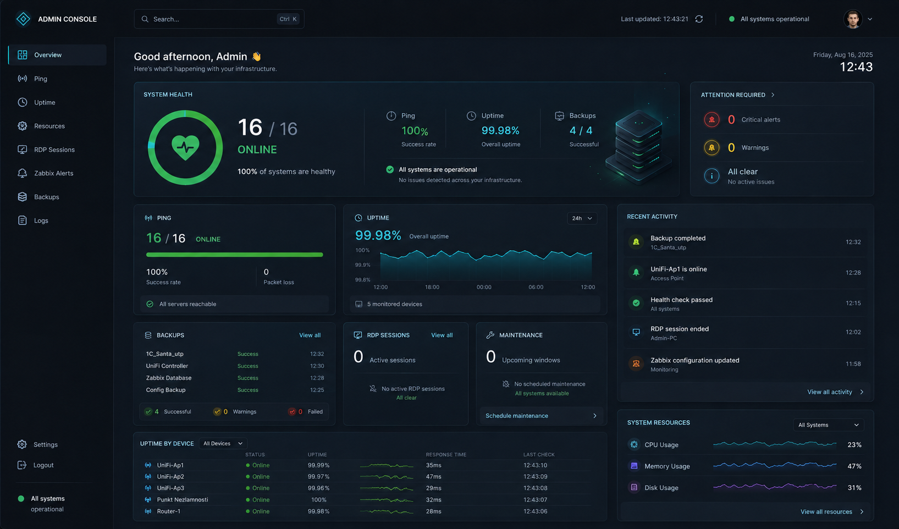
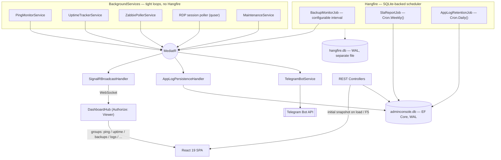

# AdminConsole

[](https://dotnet.microsoft.com/)
[](https://react.dev/)
[](https://www.typescriptlang.org/)
[](https://vitejs.dev/)
[](#architecture)
[](#architecture)
[-07405E?logo=sqlite&logoColor=white)](#architecture)
[](#security--architecture)
[](#engineering-practices)
[](#central-package-management)

**A self-hosted, real-time infrastructure monitoring and management console** — ping, uptime/SLA, RDP session tracking, Zabbix alerts, backup verification, scheduled maintenance, and a Telegram bot, all in one dashboard.

AdminConsole v3 is the full rewrite of a legacy WPF desktop application into a **headless ASP.NET Core Windows Service with a React web front end**. Where the original tool only worked at the console of whichever machine it was installed on, this version runs unattended as a background service and is reachable from any browser on the network — no RDP session, no desktop session, no client install. Every monitoring loop, alerting rule, and management action from the desktop era was ported, and several — live SLA reporting, scheduled maintenance windows, Telegram-based approvals — were rebuilt to be genuinely web-native rather than emulated.



---

## Table of Contents

- [Overview](#overview)
- [Architecture](#architecture)
- [Key Features](#key-features)
- [Background Services — Implementation Deep Dive](#background-services--implementation-deep-dive)
- [Engineering Practices](#engineering-practices)
- [Security & Architecture](#security--architecture)
- [Prerequisites & Environment Requirements](#prerequisites--environment-requirements)
- [Local Development](#local-development)
- [Configuration (`appsettings.json`)](#configuration-appsettingsjson)
- [Deployment / Release Pipeline](#deployment--release-pipeline)
- [API Reference](#api-reference)
- [Database Backup & Restore](#database-backup--restore)
- [Troubleshooting](#troubleshooting)
- [Logging](#logging)
- [Dependencies](#dependencies)
- [Known Limitations](#known-limitations)
- [Changelog](#changelog)
- [Project Structure](#project-structure)

---

## Overview

Infrastructure teams running a self-hosted Windows/AD environment tend to accumulate a pile of single-purpose tools: a ping sweeper, a backup-age checker, an RDP session tracker, a Zabbix tab that's always open, a spreadsheet for maintenance windows, and a phone full of alert emails nobody reads in time. AdminConsole replaces that pile with one process and one dashboard.

The original version of this tool was a WPF desktop application — it worked, but only from the console of the one machine it was installed on, under the identity of whoever was logged in, with no way to check status remotely short of an RDP session into that box. **v3 is a ground-up rewrite**, not a port with a new coat of paint:

- The desktop client became a **headless ASP.NET Core Windows Service**. There is no window to open, no user to log in as — Kestrel listens on the network from boot, under a dedicated service account, whether or not anyone is watching.
- The UI became a **React single-page application**, served by the same process and reachable from any browser on the domain, authenticated transparently via Windows Integrated Authentication — no second login, no separate credential store.
- State that used to live only in the WPF window's memory (current ping status, active alerts, live sessions) now flows through a proper **domain-event bus** (MediatR) fanned out over **SignalR**, so the dashboard, the Telegram bot, and the persisted audit log are always looking at the same truth, not three independent implementations that can drift apart.
- Every monitoring loop, alert rule, and management action from the desktop era was ported feature-for-feature; SLA reporting, maintenance windows, and Telegram-based user approval were **rebuilt** rather than carried over, because the desktop versions leaned on things (a visible window, an interactive desktop, local file dialogs) that simply don't exist in a headless service.

---

## Architecture

AdminConsole is built around one idea: **every monitoring service produces typed domain events, and every consumer of those events — the browser, the Telegram bot, the persisted log — is just another subscriber.** Nothing polls the database to find out what changed; nothing holds a second copy of state that can quietly disagree with the first.



### Two scheduling models, chosen deliberately

Not every recurring piece of work belongs on the same clock:

- **Tight-loop `BackgroundService`s** — ping, uptime tracking, Zabbix polling, RDP session polling — run on sub-minute cadences (as fast as every 10 seconds for offline-host recovery checks). Hangfire's storage-backed dispatch model adds overhead that doesn't pay for itself at that frequency, so these run as plain hosted services with their own `Task.Delay` loops instead.
- **Hangfire** owns the three jobs that genuinely are "run occasionally, and it's fine if a run is a few seconds late": `BackupMonitorJob` (configurable interval, default hourly), `SlaReportJob` (`Cron.Weekly()`), and `AppLogRetentionJob` (`Cron.Daily()`, purges log rows older than 90 days). Registration goes through `IRecurringJobManager` (the DI-scoped API) rather than the static `RecurringJob` facade — the static API reads `JobStorage.Current`, which is never populated when Hangfire is wired up purely through `AddHangfire()` dependency injection.

### Two SQLite databases, on purpose

`adminconsole.db` (EF Core — servers, downtime records, backup state, app settings, the persisted log) and `hangfire.db` (Hangfire's own job/schedule storage, via `Hangfire.Storage.SQLite`) are **two separate files**, both running in **WAL (Write-Ahead Logging) mode**. Keeping them apart means Hangfire's own write traffic (job state transitions, retries) never contends for the same file lock as application reads/writes, and either database can be inspected, backed up, or migrated independently.

### Key Architectural Decisions

**CAS instead of locks for ping state.** `PingMonitorService` has no `lock`/`Mutex` guarding server status at all. `_previousStatus` is a `ConcurrentDictionary<string, PingStatus>`, and every transition goes through `GetOrAdd` + `TryUpdate` (compare-and-swap) — only the thread that actually wins the race logs the transition; the loser's `TryUpdate` simply returns `false` and stays silent. The main loop (all servers, every `PingIntervalSeconds`) and the recovery loop (Offline servers only, every `OfflinePingIntervalSeconds`) both write to the same dictionary from separate `Task`s with zero contention overhead.

**Per-server locks solve what CAS can't.** CAS keeps the dictionary itself correct, but it doesn't stop two *different* call paths — the background loop and an on-demand `/ping` from Telegram or the REST API — from polling the *same* server concurrently and each independently deciding "this is a transition, log it," producing a duplicate or dropped log line. `PingMonitorService` and `RdpMonitorService` both keep a `ConcurrentDictionary<string, SemaphoreSlim>` keyed by IP (`_perServerLocks`) that serializes exactly at "one server" granularity — every *other* server still polls fully in parallel.

**Dual-loop ping, mutually guarded.** `RunMainLoopAsync` and `RunRecoveryLoopAsync` run as two `Task`s under `Task.WhenAll`, each wrapped in `RunLoopGuardedAsync`: if either loop throws, it cancels a shared `LinkedCancellationTokenSource` before rethrowing — one loop crashing can never leave the other running forever unattended, but a normal `OperationCanceledException` at shutdown is swallowed, not treated as a crash.

**Anti-flapping via a two-stage Pending → Confirmed incident.** `UptimeTrackerService` does not write a `DowntimeRecord` the instant a server goes Offline. The drop first lands in an in-memory-only `_pendingOffline` dictionary; only if the server is *still* Offline after `MinIncidentDurationSeconds` does it "mature" into a real, persisted incident — with `FellAt` set to the original drop time, not the promotion time. A blip shorter than the threshold never touches SQLite and never flickers onto the UI. On restart, `_reconciledIps` drives a one-time reconciliation pass per server: the first real (non-`Checking`) status after startup is checked directly against whatever incidents are already loaded from the DB, so a server that recovered while the service was down doesn't stay "open" forever.

**The SLA formula has exactly one code path for every incident shape.** `SlaReportService` computes `EffectiveEnd = RecoveredAt ?? Min(Now, To)`, then clips `[FellAt, EffectiveEnd]` against the requested `[From, To]` window (`ClippedDuration`) — the same function handles a closed incident, one still open on a live server, and an "orphaned" open incident on a server since removed from `appsettings.json`, with no branching by case. `Min(Now, To)` is applied to the *denominator* of the uptime-percent calculation too, not just to individual incidents — otherwise a report requested with "To: today" would count the as-yet-unlived remainder of the day as free 100% uptime, understating real downtime.

**Maintenance is a hybrid Pull + Push service.** `MaintenanceService` is simultaneously a `BackgroundService` (a 30-second loop that auto-expires windows past their `To`) and a plain singleton exposing a synchronous `IsUnderMaintenance(ip, group)` — pollers call it as a **Pull** on every single cycle, before deciding whether an Offline result should log a Warning/Error, with no MediatR round-trip latency. State *changes* (`Started`/`Ended`) are additionally **Pushed** via `MaintenanceChangedOccurred`, so `UptimeTrackerService` can force-close an already-open incident the moment a window starts, and `PingMonitorService`/`UptimeTrackerService` can reset their own transition-tracking state the moment a window ends — deliberately resetting to different values in each (`Unknown` in `PingMonitorService`, `Online` in `UptimeTrackerService`) because each service treats a same-named state differently in its own transition logic; using the "obvious" identical reset in both would silently reintroduce the bug it fixes in the other. Maintenance windows are cleared entirely on graceful shutdown (`ClearAllOnShutdownAsync`) — including "no time limit" windows — so a forgotten indefinite window can never silently suppress alerts across a routine service restart.

**A shared wake-up pattern for toggle-controlled pollers.** `RdpMonitorService` and `ZabbixPollerService` both sleep via `Task.Delay` against a `CancellationTokenSource` stored in a field (`_wakeUpCts`), swapped atomically with `Interlocked.Exchange`. Enabling monitoring, saving new credentials, or changing the Zabbix severity threshold in Settings cancels that token, waking the poller for an immediate out-of-band cycle instead of waiting up to a full `*PollIntervalSeconds`. Critically, the toggle notification itself is never trusted as the source of truth — every cycle re-reads `IAppSettingsRepository` (a **Pull**) before touching credentials at all, so a missed or reordered event can never leave a poller stuck thinking monitoring is enabled when it isn't (or vice versa).

**Every notification handler must survive its own failure.** MediatR's default `Publish` runs handlers for one event sequentially and stops at the first exception. Early on, `UptimeTrackerService.Handle(PingBatchResultOccurred)` had no exception boundary at all — a transient DB failure there propagated back through `PingMonitorService`'s loop guard, which cancels *both* ping loops together by design, permanently halting all ping monitoring over one missed database write. Every handler with real failure modes (DB I/O, external calls) is now wrapped in its own try/catch that logs an `AppLogEntryOccurred.Error` and swallows anything but `OperationCanceledException` — a subscriber is never allowed to take down its publisher.

**DPAPI-NG via `IDataProtector`, not the old Win32 Credential Manager.** Secrets are stored in a `StoredCredentials` SQLite table, encrypted with `Microsoft.AspNetCore.DataProtection`'s `IDataProtector` (keys persisted to disk and protected with DPAPI-NG). RDP credentials were removed from this store entirely — the service now runs under a dedicated domain account and authenticates to target servers directly via Kerberos, so there's nothing left to encrypt for RDP at all. Only the Zabbix API token and the Telegram bot token remain.

**Single-row settings, protected against a startup race.** `AppSettings` is a one-row table with no unique constraint beyond its autoincrement key. At process start, `RdpMonitorService` and `ZabbixPollerService` each open their own `DbContext` scope and can call `GetAsync` at nearly the same instant — without protection, both could miss-see an empty table and both insert their own row. A static `SemaphoreSlim` gate (`AppSettingsRepository.CreateGate`) serializes just this path, with a re-check *inside* the lock in case the other caller already won the race while this one was waiting.

### Domain Events (MediatR)

Every background service communicates exclusively through typed `INotificationHandler<T>` subscriptions — there is no direct reference from a producer to a consumer anywhere in this list:

| Event | Published by | Subscribers |
|---|---|---|
| `PingBatchResultOccurred` | `PingMonitorService` | `UptimeTrackerService`, `TelegramBotService`, `SignalRBroadcastHandler` |
| `UptimeUpdatedOccurred` | `UptimeTrackerService` | `TelegramBotService`, `SignalRBroadcastHandler` |
| `MaintenanceChangedOccurred` | `MaintenanceService` | `PingMonitorService`, `UptimeTrackerService`, `SignalRBroadcastHandler` (fans out to both the `ping` and `uptime` SignalR groups) |
| `BackupStatusUpdatedOccurred` | `BackupMonitorJob` | `SignalRBroadcastHandler` |
| `BackupTransitionOccurred` | `BackupMonitorJob` | `TelegramBotService` (Stale/Missing alerts) |
| `RdpSessionsUpdatedOccurred` | `RdpMonitorService` | `TelegramBotService`, `SignalRBroadcastHandler` |
| `ZabbixProblemsUpdatedOccurred` | `ZabbixPollerService` | `SignalRBroadcastHandler` |
| `CredentialsChangedOccurred` | `CredentialsController` | `ZabbixPollerService` (wake-up), `TelegramBotService` |
| `MonitoringToggledOccurred` | `MonitoringController` | `RdpMonitorService`, `ZabbixPollerService` (wake-up), `SignalRBroadcastHandler` |
| `TelegramAccessChangedOccurred` | `TelegramAccessControlService` | `SignalRBroadcastHandler` |
| `TelegramAccessRequestOccurred` | `TelegramAccessControlService` | `SignalRBroadcastHandler` |
| `AppLogEntryOccurred` | Any service, on virtually every state change | `AppLogPersistenceHandler` (SQLite), `SignalRBroadcastHandler` (`logs` group) — registered as **two independent handlers** for the same event, so a DB write failure in one can never suppress the other |

Handlers with no page of their own in the current frontend (RDP, Zabbix, monitoring toggles, Telegram access) still broadcast into the shared `logs` SignalR group — every domain event is visible somewhere, even without a dedicated UI surface for it yet.

### Backend — `AdminConsole.Api` / `AdminConsole.Infrastructure` / `AdminConsole.Domain`

| Concern | Technology |
|---|---|
| Runtime | ASP.NET Core 8 (`net8.0-windows`), self-hosted Kestrel, runs as a **Windows Service** via `Microsoft.Extensions.Hosting.WindowsServices` — no IIS, no reverse proxy |
| Data access | Entity Framework Core 8 + **SQLite** (WAL mode), code-first migrations |
| Real-time updates | **SignalR** — `DashboardHub` fans domain events out to the browser over a single connection, grouped by page (`ping`, `uptime`, `backups`, `logs`, …) so a client only receives the stream it's actually subscribed to |
| Background jobs | **Hangfire** (SQLite storage) for scheduled work that tolerates a loose clock; tight polling loops run as native `BackgroundService`s instead — see [Two scheduling models](#two-scheduling-models-chosen-deliberately) |
| Domain events | **MediatR** as the internal event bus — every monitoring service publishes typed notifications; `SignalRBroadcastHandler`, `AppLogPersistenceHandler`, and `TelegramBotService` all subscribe independently, with no direct coupling between producer and consumer |
| Remote management | **WMI** (`System.Management`, `Win32_OperatingSystem.Win32Shutdown`) for remote restart/shutdown; `quser` process invocation (Kerberos-authenticated, no stored credentials) for RDP session polling |
| Secrets at rest | Windows **Data Protection API** (DPAPI-NG) encrypting an `AdminConsoleDb` table — no plaintext credentials on disk |
| Telegram bot | `Telegram.Bot` client running in-process as another `BackgroundService`, sharing the same Singleton monitoring services the API talks to |
| Authentication | Windows Integrated Authentication (**NTLM/Kerberos via Negotiate**), authorized by Active Directory group membership, enforced by a `Viewer` authorization policy on both the REST controllers and the SignalR hub |

### Frontend — `adminconsole-web`

| Concern | Technology |
|---|---|
| Framework | **React 19** + **TypeScript**, built with **Vite 8** |
| Styling | **SCSS Modules** against a single design-token stylesheet (colors, spacing, typography) — no CSS-in-JS, no component library |
| Real-time | `@microsoft/signalr` client, one shared connection per session, ref-counted per-page group subscriptions (a page joins its SignalR group on mount and leaves it on unmount, so switching tabs never leaks a subscription) |
| Routing | `react-router-dom` 7 |
| Linting | `oxlint` — a Rust-based linter, chosen for near-instant feedback over the TypeScript project without a separate ESLint toolchain |
| Data pattern | Every page composes small `use*` hooks that combine an initial REST snapshot with live SignalR updates, so a page never shows a misleadingly empty state before the first push arrives |

The production build is **embedded directly into the ASP.NET Core host** — `dotnet publish` runs `npm run build` and copies the Vite output straight into `wwwroot` via an MSBuild target (`PublishFrontend`, gated on `Configuration == Release`), so the shipped artifact is a single self-contained Windows executable serving both the API and the SPA. No Node.js runtime, npm, or separate web server is needed on the target machine.

---

## Key Features

### Dashboard & Uptime
A single Overview page rolls up system health, ping success rate, live uptime percentage, recent activity, active backups, RDP sessions, and scheduled maintenance into one glance. The Uptime page tracks every Online↔Offline transition per server with **anti-flapping** (a downtime shorter than a configurable threshold never becomes a recorded incident) and produces **on-demand SLA reports** — per-server uptime %, downtime, incident count, MTTR, and a maintenance appendix — rendered as a self-contained, offline-viewable HTML document opened in a new tab. The same report is also generated automatically every week by `SlaReportJob` on Hangfire's schedule.

### Ping & Server Management
A dual-cadence background loop pings every configured host (a faster recovery loop re-checks only currently-offline hosts, so recovery is detected quickly without hammering healthy servers). From the same table, Windows hosts support:
- **Restart / Shutdown** — a WMI call against the remote machine, confirmed through a modal, with no interactive process spawned on the server (the service runs headless, so there's no desktop session to open a window on).
- **RDP** — generates a ready-to-open `.rdp` file on the fly (target address prefilled, no stored credentials — Windows prompts for them locally), the closest thing to a one-click launch a browser can safely do.
- **Continuous ping** — an in-browser modal that polls the live ping endpoint once a second for as long as it's open, replacing the desktop app's ability to spawn its own terminal window.

### RDP Sessions
Polls terminal servers via `quser` under the service's own Kerberos identity (no credentials stored or prompted per poll), tracks session state transitions (connected / disconnected / resumed), daily peak concurrent sessions, and last-logout history. Only servers placed in the `"Terminal Servers"` group are polled — everything else is skipped rather than probed and ignored.

### Zabbix Integration
Requires **Zabbix 6.0 or newer** — authentication is Bearer-token only (legacy username/password and pre-6.0 session-token auth are not supported). Polls the Zabbix API for active problems on a configurable interval, authenticating with an API token (entered and tested directly from Settings) with automatic backoff on repeated auth failures. The **minimum severity threshold** is itself configurable — a slider in Settings lets an admin pick any level from Warning up through Disaster, and only problems at or above that threshold are fetched and counted. The Overview page's **Zabbix Monitor** card shows live Critical / Warning / Info counts side by side, plus a segmented, self-relative composition bar underneath — each severity's share of the *current* total, labeled with a percentage, rather than a gauge measured against a hardcoded "normal" ceiling (problem volume varies too much for that to mean anything).

### Backup Monitoring
Evaluates each configured backup job against file age and a rolling size baseline, with anti-flapping so a single bad read doesn't flip a job's status. A job can independently track a Full and a Differential pattern, each with its own max-age threshold. Surfaces per-job size history, total backup size across the fleet, and pushes Telegram alerts the moment a job goes Stale or Missing.

### Maintenance Windows
Start a maintenance window against a single server or an entire group, with duration presets or no time limit. While active, Ping and Backup alerting is suppressed and the corresponding uptime incident is marked as maintenance-related rather than counted against SLA. Windows auto-expire on schedule or can be ended early from the same UI that started them.

### Telegram Bot
A full admin bot living in the same process as the API: a one-time **claim code** binds the first Primary Admin, new users are approved or denied through **inline keyboard buttons** (mirrored in the web Settings page, so either side can act), and the bot pushes real-time alerts for new incidents and backup transitions. Command menu covers live status, offline hosts, open incidents, RDP sessions, maintenance, on-demand ping, and backup state — all reading from the exact same in-memory services the web dashboard uses, so the two are never out of sync.

Messages are built as proper **Telegram HTML** (`parse_mode=HTML`, not plain-text or Markdown escaping) via a dedicated `TelegramMessageFormatter` — backup and maintenance blocks render server names in bold, timestamps in monospace `<code>`, and status text bolded on failure, with every fragment guaranteed to close its own tags so pagination (`TelegramTextChunker`, for chats with many servers) never splits a message mid-tag.

---

## Background Services — Implementation Deep Dive

### PingMonitorService

Two independent `Task`s under `Task.WhenAll`, each guarded so one loop's crash cancels the other rather than leaving it running solo forever:

```
ExecuteAsync
├── RunMainLoopAsync     — every server, every PingIntervalSeconds
│   └── PingServersAsync — its own ConcurrentBag, one PingBatchResultOccurred per cycle
└── RunRecoveryLoopAsync — Offline servers only, every OfflinePingIntervalSeconds
    └── PingServersAsync — a separate SemaphoreSlim(5), a separate ConcurrentBag
```

Throttling uses two independent `SemaphoreSlim`s — `_mainThrottle` (10 slots) and `_recoveryThrottle` (5 slots) — so the recovery loop is never starved waiting on the main loop's slots, and vice versa. A per-server `SemaphoreSlim` (`_perServerLocks`) additionally serializes the main loop, the recovery loop, and any on-demand `/ping` request against the *same* IP, so a Telegram `/ping` firing at the exact moment the background loop reaches that server can't race it for the transition log. On-demand pings (`PingAllNowAsync`, used by both the REST snapshot and Telegram's `/ping`) go through an `OnDemandSnapshotThrottle` that caps how often a *new* sweep actually runs — repeated requests inside the current `PingIntervalSeconds` window get the already-computed result instead of triggering a fresh ICMP sweep against every server. `GetSnapshot()` exposes the live `_previousStatus` dictionary read-only, so the bot and the REST snapshot endpoint answer correctly even in the first seconds after startup, before the first full cycle completes.

### UptimeTrackerService

Subscribes to `PingBatchResultOccurred` and `MaintenanceChangedOccurred`. The anti-flapping Pending→Confirmed logic is described under [Key Architectural Decisions](#key-architectural-decisions) above; three details worth calling out on top of that:

- **The write happens *after* releasing the in-memory lock, not inside a debounced background flush.** Every confirmed change calls `IDowntimeRepository.UpsertAsync` directly, right after the `lock (_lock)` block that mutated `_records` exits — there's no batching window and therefore no "last few hundred milliseconds lost on shutdown" failure mode to guard against at all.
- **`GetSnapshot()` returns deep clones, not the live mutable objects.** `SlaReportService.Generate()` reads a snapshot from a separate call context while the background loop may still be mutating the same `DowntimeRecord.RecoveredAt`/`ClosedByMaintenance` fields — `CloneRecord()` freezes a consistent copy under the same lock the mutations use.
- **Reconciliation runs exactly once per server, keyed by `_reconciledIps`.** Right after a restart, `_lastStatus` is empty, so the normal "was it previously Offline" check can't fire for a server that recovered while the service was down — the first real ping this session for that IP is instead checked directly against whatever's already loaded from the DB, closing an "orphaned" open incident if one exists.

### MaintenanceService

Pull API (`IsUnderMaintenance`, `GetActiveWindow`) plus a 30-second `BackgroundService` loop that auto-expires windows past their `To`. Storage is a `ConcurrentDictionary<string, MaintenanceWindow>` keyed by `ServerIp` or `"group:{TargetGroup}"` — read concurrently from every poller on every cycle, written from the REST API and from the service's own expiry loop. `StartAsync` loads persisted windows from SQLite *before* `base.StartAsync` returns, guaranteeing the Pull API is never queried against an empty cache during the host's own startup sequence — `PingMonitorService` and `UptimeTrackerService` both depend on `MaintenanceService` being fully loaded first.

### RdpMonitorService

Polls only servers in the `"Terminal Servers"` group via `quser.exe /server:{domain-name}` — deliberately the domain name, never the IP, since `quser` resolves over Named Pipes/NetBIOS and an IP triggers `RPC server is unavailable`. The service authenticates as itself (Kerberos, the dedicated `DOMAIN\svc_adminconsole` account) — no per-call credential handling at all. Output is parsed with two `Regex`es (`Active`/`Disconnected` session lines), both compiled with an explicit `matchTimeout: 500ms` as a guard against catastrophic backtracking on malformed input. Session state is diffed against the previous poll's snapshot (`_previousSessions`, a `ConcurrentDictionary<string, Dictionary<int, RdpSessionInfo>>`) so only real transitions get logged: `Active → Disconnected` (a user simply closing their RDP client without formally logging off) is logged as **Info**, not Warning — it's the expected way most users disconnect, not a problem. The very first poll for a server never logs anything — it silently seeds the snapshot instead of reporting every already-existing session as "newly connected."

The daily peak-concurrent-sessions counter (`_globalDailyPeak`) is computed and persisted as one atomic unit under a dedicated `SemaphoreSlim` (`_peakGate`): without it, polling multiple servers in parallel (`Task.WhenAll`) could compute a higher peak on one server and a lower one on another, and have their two asynchronous DB writes land out of order — silently overwriting the correct higher value with a stale lower one. The peak is also restored from `AppSettings.RdpDailyPeak`/`RdpDailyPeakDate` on the first toggle check after startup (only if the stored date is still "today"), so a routine service restart mid-day doesn't reset an already-observed peak back to zero.

### ZabbixPollerService

Authenticates with an API token only (legacy username/password auth was removed entirely). `_currentMinSeverity` (a `volatile int`, refreshed on every toggle check) drives `BuildWatchedSeverities`, which expands a single threshold into the full list of severities to request from the Zabbix API — e.g. a threshold of `4` (High) becomes `[4, 5]` (High + Disaster). Shares the same Pull-before-credentials toggle pattern and cancel-and-restart wake-up mechanism as `RdpMonitorService` (see [Key Architectural Decisions](#key-architectural-decisions)).

### BackupMonitorJob / BackupCheckEvaluator

`BackupCheckEvaluator` is pure, stateless logic — given a file-system path and a rolling size history, it returns an `Ok`/`SizeWarning`/`Stale`/`Missing`/`Unknown` result with no side effects, which is what makes it directly unit-testable without a host or DI container. Before touching the file system for a UNC path, it does a cheap reachability ping (`WinEventLogReader.IsReachableAsync`, 1-second timeout) — `Directory.Exists`/`EnumerateFiles` against an unreachable network share can block on a native Windows timeout for **tens of seconds**, and a `CancellationToken` doesn't help there since it can't cancel an already-running synchronous system call. Size-deviation comparison guards against two historical edge cases: an empty or too-small history returns `Ok` rather than dividing by a zero-length sequence, and an average of exactly zero (a history of all-zero-size samples) is guarded separately before the percentage-deviation division. `BackupMonitorJob` (the Hangfire-scheduled wrapper) applies anti-flapping on top — a single bad read doesn't immediately flip a job's displayed status — and persists state through `BackupStateRepository.UpsertAsync`, which replaces a check's entire size-history child collection on every write (`History.Clear()` + rebuild) rather than diffing it — a deliberate, accepted simplicity/correctness tradeoff for a collection that's small and fully owned by one job.

### SlaReportService / SlaReportJob

`SlaReportService.Generate()` is a pure function — given a request and `UptimeTrackerService.GetSnapshot()`, it returns a `SlaReport` with no file or network I/O, which is what makes its uptime-percentage and clipping math independently unit-testable. The clipping formula is covered under [Key Architectural Decisions](#key-architectural-decisions). `SlaReportJob` runs the same computation weekly on Hangfire's `Cron.Weekly()` schedule and, since an audit hardening pass, wraps the whole run in a try/catch that publishes a visible `AppLogEntryOccurred.Error` on failure — previously an exception here surfaced only as an opaque Hangfire "Failed" job entry, invisible anywhere in the app's own UI.

### AppLogPersistenceHandler / AppLogRetentionJob

`AppLogPersistenceHandler` is the entire replacement for the old WPF app's rolling-file logger — every `AppLogEntryOccurred` is written straight to the `AppLogEntries` SQLite table, turning "tail the newest log file" into `ORDER BY Timestamp DESC LIMIT :take`. Because MediatR fans the same event out to multiple handlers independently, a failure persisting to SQLite can never suppress the SignalR broadcast of the same entry, or vice versa. `AppLogRetentionJob` runs daily on Hangfire (`Cron.Daily()`) and deletes rows older than a fixed 90-day cutoff — added after an audit finding that the table had **no** retention policy at all, and every monitoring loop (Ping, RDP, Zabbix, Backup, Uptime) writes to it on every cycle, forever.

### TelegramBotService / TelegramAccessControlService

`TelegramAccessControlService` centralizes every access-control decision: a single Primary Admin (bound once via a 10-minute single-use numeric claim code, in-memory only — deliberately doesn't survive a restart), an allow-list of approved `chat_id`s cached in memory and mirrored to SQLite, and layered anti-abuse limits — a sliding-window rate limit (10 actions/minute per chat), a stricter separate 20-second cooldown just for `/ping` (the most expensive command), a 15-minute cooldown before a denied/revoked user can request access again, and a hard cap of 50 concurrent pending requests with a 24-hour TTL. `PurgeExpiredThrottleState()` sweeps all three `ConcurrentDictionary`-based throttle stores on every new request, so none of them grow unbounded over months of uptime. Two small utilities support the bot's UX: `TelegramCallbackRegistry` maps arbitrary strings to short numeric IDs (Telegram's `callback_data` is capped at 64 bytes) through a bidirectional `ConcurrentDictionary` pair with race-safe deduplication via `GetOrAdd`, and `TelegramTextChunker` paginates long lists under Telegram's 4096-character message limit with a safety margin, never splitting a single line across pages.

### SignalRBroadcastHandler

The single bridge from every domain event to the browser — see the [Domain Events](#domain-events-mediatr) table above for the full event-to-group mapping. Events without a dedicated frontend page yet (RDP, Zabbix, toggles, Telegram access) still broadcast into the shared `logs` group rather than being dropped, so nothing published is ever silently invisible to the UI.

---

## Engineering Practices

### Central Package Management

Every project in the solution resolves NuGet versions from **one file** — [`Directory.Packages.props`](Directory.Packages.props) — with `ManagePackageVersionsCentrally` enabled, rather than each `.csproj` pinning its own versions. A `PackageReference` in a project file carries no version at all; the version lives centrally, once, and every project agrees by construction.

`CentralPackageTransitivePinningEnabled` is also turned on, which promotes every version in that file from "the version this project asks for" to **an absolute pin across the entire dependency graph**, including transitive dependencies. That distinction is not academic — it was added after a real incident: a plain `PackageReference` version pin on `Newtonsoft.Json` only wins against a *lower* transitive requirement pulled in elsewhere; a *higher* one (in this case, dragged in transitively by `Hangfire.AspNetCore`/`MediatR` inside `AdminConsole.Api`'s own graph) still overrides it silently. The result: `AdminConsole.Api` resolved `Newtonsoft.Json 13.0.4` while `AdminConsole.Infrastructure`/`AdminConsole.Migration` resolved a pinned `13.0.3` — two self-contained publish outputs disagreeing about the exact same shared DLL. [`publish.ps1`'s](#deployment--release-pipeline) staged-merge hash check is what caught it; transitive pinning is what closes the gap permanently.

[`Directory.Build.props`](Directory.Build.props) solves a sibling problem one layer down: `RuntimeFrameworkVersion` for `net8.0-windows` is pinned explicitly to the patch version actually installed on the build machine. Runtime-pack resolution for self-contained publish isn't a `PackageReference` at all, so no amount of Central Package Management touches it — `AdminConsole.Api` (an `Sdk="Microsoft.NET.Sdk.Web"` project) and `AdminConsole.Migration` (plain `Microsoft.NET.Sdk`) were independently rolling forward to different NuGet-published patch builds of the ASP.NET Core runtime pack, producing two more silently-conflicting shared DLLs. Pinning both to the locally-installed version makes them agree deterministically, with no extra NuGet download for either.

### Release Pipeline

[`publish.ps1`](publish.ps1) is the single command that turns the repository into a deployable artifact — self-contained, `win-x64`, no separate .NET runtime install required on the target server. It does more than shell out to `dotnet publish`:

1. **Isolated staging.** `AdminConsole.Api` and `AdminConsole.Migration` each publish into their *own* staging subfolder first, never straight into the shared `publish/` output.
2. **Hash-verified merge.** The two staged outputs are merged into `publish/` file by file. If a file exists in both outputs, its SHA-256 hash is compared — identical content merges silently, but a **real conflict** (same relative path, different bytes — i.e. the two projects resolved a shared dependency to different versions) is collected, not resolved by last-write-wins.
3. **Hard failure on conflict.** If any conflicts were found, the script prints every offending path and `throw`s, aborting the publish. A previous version of this script only warned and still exited 0 — a broken publish could be reported as a success. It can't anymore.
4. **Post-publish verification.** Before printing a success banner, the script checks that at least one `.exe` exists in the output and that `wwwroot` exists and is non-empty (i.e. the frontend actually built and got embedded). Both checks `throw` on failure rather than just logging a warning — the same "gate, don't just log" philosophy applied throughout.

`-p:PublishSingleFile=true` is deliberately **not** used: the old WPF client's single-file mode existed to solve a BAML-resource-extraction problem specific to WPF, and Kestrel has no equivalent dependency — enabling it here would only add a temp-extraction step to every startup for no corresponding benefit.

### Concurrency & Thread-Safety

| Component | Mechanism | Why |
|---|---|---|
| `PingMonitorService._previousStatus` | `ConcurrentDictionary` + `TryUpdate` (CAS) | Main loop and recovery loop write concurrently; only the thread that wins the compare-and-swap logs the transition |
| `PingMonitorService`/`RdpMonitorService._perServerLocks` | `SemaphoreSlim` per IP | Serializes the background loop against on-demand REST/Telegram requests for the *same* server — TOCTOU protection without blocking other servers |
| `PingMonitorService._mainThrottle` / `_recoveryThrottle` | Two independent `SemaphoreSlim`s (10 / 5) | The recovery loop is never starved by the main loop's slots, or vice versa |
| `UptimeTrackerService._lock` | `lock` (monotype `object`) | Guards `_records`/`_lastStatus`/`_pendingOffline`; the DB write happens *after* the lock is released, not inside it |
| `UptimeTrackerService.GetSnapshot()` | Deep clone (`CloneRecord`) under `_lock` | `SlaReportService.Generate()` reads a consistent snapshot while the background loop may still be mutating the same records |
| `RdpMonitorService._peakGate` | `SemaphoreSlim(1,1)` around compute+persist | Prevents an out-of-order async DB write from silently overwriting a higher daily-peak value with a stale lower one |
| `RdpMonitorService._stateLock` | `lock` | Guards `_globalDailyPeak`/`_lastLogout*`, read from the REST snapshot path and written from the poll loop |
| `RdpMonitorService`/`ZabbixPollerService._wakeUpCts` | `Interlocked.Exchange` | Lets a Settings change (toggle/credentials) cancel the current sleep for an immediate out-of-band poll, race-free against the loop reassigning the same field |
| `CredentialStore._lock` | `lock` | Guards the in-memory token cache shared by the poll loop and the Settings API |
| `AppSettingsRepository.CreateGate` | Static `SemaphoreSlim(1,1)`, re-checked inside the lock | Prevents two concurrent `DbContext` scopes from both missing the single settings row and both inserting a duplicate |
| `TelegramAccessControlService` rate limits | `ConcurrentDictionary<long, ConcurrentQueue<...>>` per `chat_id` + `PurgeExpiredThrottleState()` | Read/written from the bot's polling loop; periodic sweep keeps memory bounded across months of uptime |
| `TelegramCallbackRegistry` | Bidirectional `ConcurrentDictionary` pair, dedup via `GetOrAdd` | Registering the same value twice returns the same short ID instead of leaking a new entry every time |

### Reliability Hardening

A dedicated audit pass (2026-08-23) targeted exactly one failure class across every `BackgroundService` and `INotificationHandler`: **what happens when the unexpected — a transient SQLite lock, a malformed config value, a DB write failure mid-cycle — actually occurs in production, not in a happy-path test.** The fixes that came out of it are why the services described above look the way they do:

- Every `BackgroundService.ExecuteAsync` body is now wrapped in a single top-level try/catch — previously several services only guarded the delay/sleep call, leaving the actual poll/DB logic free to throw an unhandled exception straight into `BackgroundServiceExceptionBehavior`, which terminates the entire host process by default.
- Every `INotificationHandler` with a real failure mode (DB I/O, an external call) catches broadly, logs a visible `AppLogEntryOccurred.Error`, and swallows anything but cancellation — a subscriber can no longer crash its own publisher's loop (the `UptimeTrackerService` → `PingMonitorService` chain described under [Key Architectural Decisions](#key-architectural-decisions) was the original motivating case).
- `SlaReportJob` and other Hangfire jobs surface failures as a visible in-app log entry, not just an opaque "Failed" row in Hangfire's own dashboard that nothing in the product surfaces to an admin.
- `AuthContext` on the frontend recovers from a *transient* authorization denial instead of latching into a permanent Access Denied state for the rest of the session.
- The EF Core migration tool tracks completion **per step**, not behind one global marker — a partial failure on run N doesn't force every already-completed step to redo its work (or worse, silently skip a step that never actually ran) on run N+1.

### Test Suite

**104 tests across 25 files**, using **xUnit** with **coverlet.collector** for coverage, organized to mirror the solution layout: `Controllers/`, `Data/`, `Migration/`, `Monitoring/`, `Reports/`, `Security/`, `Telegram/`, `Zabbix/`. Coverage leans toward pure-logic and integration-style tests that don't require a live Windows/AD environment to run — WMI calls, `quser` invocation, and Windows Integrated Authentication itself are inherently untestable outside that environment and are exercised manually against real infrastructure instead.

```powershell
dotnet test
```

### English-Only Interface

Every piece of user-facing text — dashboard copy, log messages, Telegram bot replies, error strings — is written in **English throughout**, independent of the team's own working language. This is a deliberate choice for an internally-facing enterprise tool: it keeps log output greppable and shareable without translation, keeps the codebase approachable to any future maintainer, and avoids the maintenance burden of a resource/localization layer for a tool with exactly one deployment target.

---

## Security & Architecture

- **Runs as a Windows Service**, not an interactive application — `Microsoft.Extensions.Hosting.WindowsServices` hosts Kestrel directly, with no reverse proxy required.
- **Windows Integrated Authentication** end to end: every request is authenticated via NTLM/Kerberos (`Negotiate`), and access is gated by membership in a configured Active Directory security group — there is no separate login form, password, or session token to manage. The same `Viewer` policy protects both the REST controllers and the `DashboardHub` SignalR connection.
- **No plaintext secrets at rest.** The Zabbix API token and the Telegram bot token are the only two secrets the app stores at all (RDP credentials were removed entirely — see below). Both live in a `StoredCredentials` SQLite table, encrypted through ASP.NET Core's `IDataProtector` (keys persisted to disk, protected with the Windows Data Protection API / DPAPI-NG) under an app-specific protection purpose string — nothing sensitive ever touches `appsettings.json`.
- **Encryption failure is a handled, explained state — not a crash.** If the DPAPI-NG key ring is ever unavailable or corrupted (e.g. the service account changed, or the SQLite file was copied to a different machine without its key folder), a **write** throws a specific `CredentialProtectionException` with an actionable message rather than a raw `CryptographicException` and a bare 500. A **read** failure is treated as "secret unavailable, not fatal" — the app falls back to prompting for the credential again via Settings instead of refusing to start.
- **Least-privilege remote management, with no stored RDP credentials at all.** The service runs under a single dedicated domain account (`DOMAIN\svc_adminconsole`) that authenticates to every managed server directly via Kerberos — for both WMI restart/shutdown *and* `quser` RDP-session polling. There is no separate credential-entry flow for RDP, no Credential Manager entries, nothing to leak: the account either has rights on the target server or it doesn't.
- **Telegram access is a separate, explicit trust boundary.** New bot users must be approved by the Primary Admin (via Telegram or the web UI, both behind the same AD-authenticated session) before the bot will respond to them; layered rate limits and cooldowns apply per chat ID (see [TelegramBotService / TelegramAccessControlService](#telegrambotservice--telegramaccesscontrolservice)).
- **Domain events, not shared mutable state.** Every monitoring service communicates through typed MediatR notifications; the SignalR layer and the persistent log are just two more subscribers, keeping the web UI, the Telegram bot, and the audit log guaranteed-consistent with each other.
- **External process arguments come only from trusted, admin-controlled config.** `quser.exe`'s hostname argument and every remote-management target originate from `appsettings.json` (edited only by an administrator with filesystem access to the host), never from end-user input reaching the API — there is no code path where a browser or Telegram request supplies a raw string that ends up as a process argument.

---

## Prerequisites & Environment Requirements

AdminConsole is built specifically for a **Windows + Active Directory** environment — it doesn't run standalone and isn't meant to be cross-platform. Before deploying, make sure the following are in place.

### Domain environment

- The host machine and every server being monitored must be joined to the **same Active Directory domain** (or trusted domains) — both Windows Integrated Authentication for the dashboard and Kerberos-based remote management depend on this.
- An **AD security group** must exist and contain everyone who should be able to open the dashboard (see [`Authorization:ViewerGroup`](#configuration-appsettingsjson) below). There's no separate login form or password — group membership *is* the access control.

### The service account

The Windows Service must run under a **dedicated domain account** (e.g. `CONTOSO\svc-adminconsole`) — never `LocalSystem` or `NetworkService`, since those authenticate as the *computer* account and typically have no rights on the servers being managed. This account needs:

- **Local Administrator rights on every managed Windows server** (or, at minimum, WMI `CIMV2` namespace permissions with remote-enable and method-execution rights) — required for the `Win32_OperatingSystem.Win32Shutdown` calls behind Restart/Shutdown.
- **Rights to query session state via `quser`** on servers in the `"Terminal Servers"` group — in practice this is already covered by the local-admin membership above.
- No Kerberos delegation configuration is required beyond a normal domain trust: the service authenticates to remote servers directly under its own identity (a single hop), not on behalf of the browser user viewing the dashboard.

### Firewall & Windows components on *target* servers

Each monitored server needs a few inbound rules enabled — all are predefined Windows Firewall groups, several of which are **off by default** on a clean Windows Server install:

| Requirement | Why it's needed |
|---|---|
| **Windows Management Instrumentation (WMI-In)** | Remote restart/shutdown, plus the underlying DCOM/RPC channel (TCP 135 + dynamic RPC ports) that WMI itself needs |
| **File and Printer Sharing** (named-pipe / RPC access) | `quser` reads Terminal Services session state over named pipes |
| **File and Printer Sharing (Echo Request — ICMPv4-In)** | The ping monitor uses real ICMP; this rule is frequently disabled by default and is the most common cause of a perfectly healthy server showing as "Offline" |
| Remote Desktop Services role | Only for hosts placed in the `"Terminal Servers"` group — `quser` has nothing to report without it |

### The AdminConsole host itself

- Ships **self-contained** (see [Deployment](#deployment--release-pipeline)) — no separate .NET runtime install is needed on the host.
- Needs its own **inbound firewall rule** for whatever port Kestrel is configured to listen on (`Kestrel:Endpoints:Http:Url`) if the dashboard will be reached from other machines rather than just `localhost`.

---

## Local Development

Running the API and the frontend as two separate dev processes gives instant backend rebuilds and Vite's hot module replacement, at the cost of one piece of setup: the browser talks to two different origins in dev (Vite's dev server and Kestrel), so Vite is configured to **proxy** both the REST API and the SignalR WebSocket through to Kestrel.

**1. Start the backend** (Kestrel, listening on `http://localhost:5074` in dev):

```powershell
dotnet run --project AdminConsole.Api
```

`AdminConsole.Api/appsettings.Development.json` ships with two harmless placeholder hosts (`DemoServer1`/`DemoServer2`, both unreachable loopback addresses) so the dashboard has something to render locally without needing real infrastructure, plus a local `DataProtection:KeyPath` so DPAPI key material doesn't depend on a machine-wide profile.

**2. Start the frontend**, in a separate terminal:

```powershell
cd adminconsole-web
npm install
npm run dev
```

Vite's dev-server config ([`vite.config.ts`](adminconsole-web/vite.config.ts)) proxies `/api` and `/hubs` to Kestrel, with one detail that matters more than it looks: both proxy entries share a single **keep-alive** HTTP agent. Windows Negotiate (NTLM/Kerberos) is a multi-step handshake bound to one TCP connection between the proxy and the backend — Node's default proxy agent doesn't keep connections alive, so without an explicit shared `Agent({ keepAlive: true })` every request looks like a *new* anonymous client to Kestrel, which repeats the 401 challenge forever instead of ever completing the handshake. `/hubs` additionally sets `ws: true` so the SignalR WebSocket upgrade itself gets proxied, not just the initial negotiate request.

**Other useful commands:**

```powershell
dotnet test              # run the 104-test xUnit suite
cd adminconsole-web
npm run lint              # oxlint
npm run build             # production build (also runs automatically during `dotnet publish -c Release`)
```

---

## Configuration (`appsettings.json`)

Everything the service needs to run lives in one `appsettings.json`, deployed alongside the executable. It's **deliberately excluded** from the publish/robocopy step (see [Deployment](#deployment--release-pipeline)) so redeploying a new build never overwrites a live server's configuration.

```jsonc
{
  "Kestrel": {
    "Endpoints": {
      "Http": { "Url": "http://*:5000" }
    }
  },

  "Authorization": {
    // AD security group allowed to open the dashboard — "DOMAIN\\GroupName".
    "ViewerGroup": "CONTOSO\\AdminConsole-Admins"
  },

  "ConnectionStrings": {
    "AdminConsoleDb": "Data Source=adminconsole.db;Cache=Shared"
  },

  "Monitoring": {
    "PingIntervalSeconds": 30,
    "OfflinePingIntervalSeconds": 10,
    "ZabbixUrl": "https://zabbix.contoso.local",
    "ZabbixPollIntervalSeconds": 60,
    "RdpPollIntervalSeconds": 120,
    "MinIncidentDurationSeconds": 10,
    "BackupPollIntervalMinutes": 60
  },

  "Servers": [
    { "Name": "APP01", "IP": "10.0.1.10", "Group": "Application Servers", "Type": "Windows" },
    { "Name": "TS01",  "IP": "10.0.1.20", "Group": "Terminal Servers",    "Type": "Windows" },
    { "Name": "web01", "IP": "10.0.1.30", "Group": "Web Servers",         "Type": "Linux" },
    { "Name": "SW-01", "IP": "10.0.1.1",  "Group": "Network",             "Type": "Network" }
  ],

  "BackupChecks": [
    {
      "Name": "APP01 SQL Backup",
      "Host": "APP01",
      "Path": "\\\\APP01\\Backups\\SQL",
      "FullPattern": "*_full_*.bak",
      "DiffPattern": "*_diff_*.bak",
      "MaxAgeHoursFull": 26,
      "MaxAgeHoursDiff": 26,
      "SizeWarningThresholdPct": 30
    }
  ]
}
```

- **`Servers`** drives every per-host feature — Ping, Uptime, and which action buttons appear: `"Type": "Windows"` unlocks Restart/Shutdown/RDP, while `"Linux"` and `"Network"` entries get ping-only monitoring. Only servers placed in the `"Terminal Servers"` group are polled for RDP sessions.
- **`BackupChecks`** — one entry per job. `Path` accepts either a local or a UNC path; `DiffPattern` can be left as an empty string for a server that has no differential backups to track.
- **No credentials live in this file.** The Zabbix API token and the Telegram bot token are entered through the web **Settings** page after the service is already running, and are encrypted at rest with the Windows Data Protection API (DPAPI-NG) before being written to SQLite — `appsettings.json` never sees them. The Zabbix minimum-severity threshold is likewise a runtime setting, changed from the same Settings page, not a config file entry.

---

## Deployment / Release Pipeline

The application ships as a self-contained, single-folder Windows deployment — no separate IIS site, no Node.js on the target machine, no manual frontend build step. See [Release Pipeline](#release-pipeline) above for what [`publish.ps1`](publish.ps1) does internally (staged per-project publish, hash-verified merge, hard failure on version conflicts, post-publish verification); the steps below are how to actually ship a release.

1. **Build the release artifact**

   ```powershell
   .\publish.ps1
   ```

   This runs `dotnet publish` for `AdminConsole.Api` and `AdminConsole.Migration` (self-contained, `win-x64`), which in turn builds the React frontend and embeds it into `wwwroot` automatically, into a single `publish/` folder. The script fails loudly — non-zero exit, thrown exception — if the two projects' dependency graphs have diverged or if the output looks incomplete; a run that prints the success banner is a run that's actually safe to deploy.

2. **Deploy to the target server**, preserving the live database and configuration:

   ```powershell
   Stop-Service AdminConsole

   robocopy "publish" "C:\Program Files\AdminConsole" /E `
     /XF appsettings.json appsettings.*.json adminconsole.db* hangfire.db*
   ```

3. **Apply pending database migrations** — `adminconsole.db` (EF Core / application data) is a separate SQLite file from `hangfire.db` (background job storage); only the former needs migrating, via the bundled console tool:

   ```powershell
   cd "C:\Program Files\AdminConsole"
   .\AdminConsole.Migration.exe
   ```

   The migration tool is idempotent — safe to run on every deploy even when there's nothing new to apply.

4. **Start the service:**

   ```powershell
   Start-Service AdminConsole
   ```

Configuration (`appsettings.json`) lives outside the publish artifact by design — server list, monitoring intervals, the authorized AD group, and backup job definitions are edited in place on the target machine and are never overwritten by a redeploy.

---

## API Reference

There is no Swagger/OpenAPI UI — `AddEndpointsApiExplorer`/`AddSwaggerGen` were deliberately never wired into `Program.cs` for an API with exactly one consumer (this repo's own SPA). The table below is the complete surface: **29 endpoints** across 12 controllers, every one gated by the same `[Authorize(Policy = "Viewer")]` policy from `AdminConsoleControllerBase` (Windows Integrated Auth + AD group membership — see [Security & Architecture](#security--architecture)). Default routing is `api/[controller]` (the controller class name, minus `Controller`, lowercased) unless a route override is noted.

| Method & Path | Controller | Purpose |
|---|---|---|
| `GET /api/servers` | `ServersController` | Configured server list (from `appsettings.json`) |
| `POST /api/servers/{ip}/restart` | `ServersController` | WMI restart — Windows servers only |
| `POST /api/servers/{ip}/shutdown` | `ServersController` | WMI shutdown — Windows servers only |
| `GET /api/servers/{ip}/rdp-file` | `ServersController` | Downloads a ready-to-open `.rdp` file, no stored credentials |
| `GET /api/ping` | `PingController` | On-demand ping sweep of every server (throttled — see `PingMonitorService`) |
| `GET /api/downtime` | `DowntimeController` | Full incident history |
| `DELETE /api/downtime?serverIp=&fellAt=` | `DowntimeController` | Deletes one **resolved** incident by natural key |
| `DELETE /api/downtime/resolved` | `DowntimeController` | Bulk-clears every resolved incident |
| `GET /api/sla/html?from=&to=&group=&server=` | `SlaController` | On-demand SLA report as a self-contained HTML document |
| `GET /api/maintenance` | `MaintenanceController` | Active maintenance windows |
| `POST /api/maintenance` | `MaintenanceController` | Starts a window (`ServerIp` XOR `TargetGroup`, optional duration/reason) |
| `DELETE /api/maintenance?key=` | `MaintenanceController` | Ends a window early, by its `ServerIp`/`"group:{name}"` key |
| `GET /api/rdp-sessions` | `RdpSessionsController` | Live `quser` snapshot — **note:** this controller carries an explicit `[Route("api/rdp-sessions")]` override; the default `[controller]` convention would resolve to `api/RdpSessions` with no hyphen, which the frontend never called (a real 404 this repo hit once) |
| `GET /api/zabbix` | `ZabbixController` | Live Zabbix active-problems snapshot |
| `GET /api/backups` | `BackupsController` | Current backup check states |
| `GET /api/logs?take=&before=&after=&search=` | `LogsController` | Paginated log query, `take` clamped to 5000 |
| `GET /api/monitoring/toggles` | `MonitoringController` | Current Ping/Zabbix/Backup toggle + Zabbix minimum-severity state |
| `PUT /api/monitoring/toggles` | `MonitoringController` | Updates toggles/severity; `ZabbixMinSeverity` validated to `1–5` server-side |
| `GET /api/credentials` | `CredentialsController` | Masked Zabbix/Telegram credential status |
| `POST /api/credentials/zabbix/token` | `CredentialsController` | Saves a Zabbix API token and immediately test-connects (`apiinfo.version`) |
| `DELETE /api/credentials/zabbix` | `CredentialsController` | Clears the stored Zabbix token |
| `POST /api/credentials/telegram` | `CredentialsController` | Saves the Telegram bot token (hot-restarts long-polling, no process restart) |
| `DELETE /api/credentials/telegram` | `CredentialsController` | Clears the stored Telegram bot token |
| `GET /api/telegramusers` | `TelegramUsersController` | Allowed Telegram users |
| `DELETE /api/telegramusers/{chatId}` | `TelegramUsersController` | Revokes a user's access |
| `POST /api/telegramusers/claim-code` | `TelegramUsersController` | Generates the one-time, 10-minute Primary Admin claim code |
| `GET /api/telegramusers/pending` | `TelegramUsersController` | Pending access requests + whether Primary Admin is already claimed |
| `POST /api/telegramusers/pending/{id}/approve` | `TelegramUsersController` | Approves a pending request |
| `POST /api/telegramusers/pending/{id}/deny` | `TelegramUsersController` | Denies a pending request (triggers the 15-minute re-request cooldown) |

Every mutating endpoint (`POST`/`PUT`/`DELETE`) that changes monitoring-relevant state publishes the matching MediatR notification (see [Domain Events](#domain-events-mediatr)) — the caller's own change appears over SignalR the same way it would for any other connected client, with no separate refetch needed on the frontend.

---

## Database Backup & Restore

AdminConsole doesn't back up *itself* — it's the tool watching everyone else's backups, so its own data needs the same discipline applied manually (or via a scheduled task on the host). Three things make up its full state, and **all three must be backed up together** — they're not independently useful:

| Path | Contents | Why it matters |
|---|---|---|
| `adminconsole.db` (+ `-wal`/`-shm`) | EF Core application data — servers' incident history, backup state, maintenance windows, app settings, persisted logs | The database itself |
| `hangfire.db` (+ `-wal`/`-shm`) | Hangfire's own job/schedule state | Without it, the next start re-seeds recurring jobs from scratch (harmless) but loses in-flight job history |
| `C:\ProgramData\AdminConsole\keys` (the `DataProtection:KeyPath` from `appsettings.json`) | The Data Protection key ring (DPAPI-NG-protected) | **Critical** — without the matching keys, the Zabbix/Telegram tokens encrypted inside `adminconsole.db` can never be decrypted again, on this machine or any other |

`appsettings.json` itself (server list, monitoring intervals, the authorized AD group, backup job definitions) is worth including too — it's excluded from the publish artifact by design ([Deployment](#deployment--release-pipeline)) and exists only on the target machine.

**Taking a backup.** Both databases run in WAL mode, but this app has no wired-up SQLite Online Backup API — the safe, simple approach is:

```powershell
Stop-Service AdminConsole

$dest = "D:\Backups\AdminConsole\$(Get-Date -Format 'yyyy-MM-dd_HHmm')"
New-Item -ItemType Directory -Path $dest | Out-Null

Copy-Item "C:\Program Files\AdminConsole\adminconsole.db*" $dest
Copy-Item "C:\Program Files\AdminConsole\hangfire.db*"      $dest
Copy-Item "C:\Program Files\AdminConsole\appsettings.json"  $dest
Copy-Item "C:\ProgramData\AdminConsole\keys" $dest -Recurse

Start-Service AdminConsole
```

Stopping the service first avoids copying a WAL file mid-checkpoint; the downtime is however long the copy takes (typically sub-second for this scale of data) — schedule it for a quiet window if even that brief a gap matters.

**Restoring.** Stop the service, replace `adminconsole.db*`, `hangfire.db*`, `appsettings.json`, and the `keys` folder with the backed-up copies, then start the service — no migration run is needed for a same-version restore, since the schema the backup was taken from already matches what's on disk.

---

## Troubleshooting

Common symptoms, matched to their actual cause in the code — most of these already log a specific `AppLogEntryOccurred.Warning`/`.Error` with the same explanation, visible on the Logs page.

| Symptom | Cause | Fix |
|---|---|---|
| A server shows **Offline** in the UI but responds to a manual `ping` from another machine | The **File and Printer Sharing (Echo Request — ICMPv4-In)** firewall rule is disabled on that server — often off by default on a clean Windows Server install | Enable the rule ([Firewall & Windows components](#firewall--windows-components-on-target-servers)) |
| RDP Sessions shows **"RPC unavailable"** for a Terminal Server | That server's `Name` in `appsettings.json` is an IP address, not a domain name — `quser` needs Named Pipes/NetBIOS resolution, which only works against a name | Set `Name` to the server's actual domain/NetBIOS name |
| RDP Sessions shows **"service account authentication failure"** or **"Access Denied"** | The service account (`DOMAIN\svc_adminconsole`) lacks rights on that Terminal Server | Grant the account the same rights described under [The service account](#the-service-account) |
| Zabbix Alerts tab stays empty, no error anywhere | `Monitoring:ZabbixUrl` isn't set in `appsettings.json` — the poller logs a Warning once and stays idle rather than retrying forever | Set `ZabbixUrl` and restart the service |
| Zabbix Alerts tab empty, but `ZabbixUrl` is set | No API token has been saved yet in Settings — the poller waits silently for one | Enter and save a token in Settings → Zabbix |
| A freshly-saved Zabbix token is rejected immediately | The target Zabbix instance is older than **6.0** — this app authenticates via the Bearer header only, which Zabbix requires 6.0+ for | Upgrade Zabbix, or use a 6.0+ instance |
| A backup check is permanently stuck on **Unknown** | The UNC host in that check's `Path` doesn't respond to a 1-second reachability check before the file scan even runs | Verify the file share's network path and that the service account has read access to it |
| A server flaps rapidly between Online/Offline in Uptime for brief network blips | `MinIncidentDurationSeconds` is too low (or `0`, which disables the anti-flapping filter entirely) for that network's baseline jitter | Raise `Monitoring:MinIncidentDurationSeconds` in `appsettings.json` |
| A saved Zabbix/Telegram credential stops working after moving the app to new hardware or restoring from a backup that didn't include the `keys` folder | DPAPI-NG key material didn't travel with the database — see [Database Backup & Restore](#database-backup--restore) | Re-enter the credential in Settings; it will encrypt correctly under the new machine's keys |
| The Telegram bot never responds to a new user | New users must be explicitly approved (inline button by the Primary Admin, or via Settings) before the bot answers anything | Approve the pending request, or check whether they're inside the 15-minute cooldown after a prior Deny |

---

## Logging

There are no rolling log *files* in v3 — the old WPF app's `logs/app-*.log` rolling-file sink was replaced entirely by `AppLogPersistenceHandler` writing straight to the `AppLogEntries` SQLite table (see [AppLogPersistenceHandler / AppLogRetentionJob](#applogpersistencehandler--applogretentionjob)). "Tail the newest log file" became `ORDER BY Timestamp DESC LIMIT :take`.

**Sources and severities.** Every background service, job, and notification handler publishes `AppLogEntryOccurred.{Info,Success,Warning,Error}(source, message)` — `source` is a short tag (`PingMonitor`, `UptimeTracker`, `Maintenance`, `RdpMonitor`, `Zabbix`, `TelegramAccess`, `AppLogRetention`, …) matching the class that raised it, mirroring the old app's `[Source]` log-line convention one for one.

**Querying.** `GET /api/logs` ([`LogsController`](#adminconsoleapi--rest-surface)) accepts `take` (default 1000, hard-clamped to a maximum of 5000 — added after an audit finding that an unbounded `take` flowed straight into EF Core's `Take()` against a table with no retention of its own, letting one request force a full-table sort), plus optional `before`/`after` timestamp bounds and a `search` substring filter — newest entries first.

**Retention.** `AppLogRetentionJob` runs daily on Hangfire and deletes any row older than a fixed **90-day** cutoff, keeping both the table and the underlying SQLite file bounded regardless of how long the service has been running unattended.

**On the frontend**, the Logs page opens with a live SignalR stream (the `logs` group) plus the same REST snapshot every other page uses on load/refresh — it's never empty immediately after a browser refresh the way a SignalR-only stream would be.

**Time zone.** Every timestamp in the app — log entries, incident `FellAt`/`RecoveredAt`, SLA report windows — is `DateTimeOffset.Now`, captured in the **host machine's local time zone**, not UTC. This is deliberate for a single-server internal tool with admins on the same site, but it means a report generated at a "To: today" boundary reflects the host's midnight, not the browsing admin's, if they're ever in a different time zone than the server.

---

## Dependencies

### Backend (NuGet, Central Package Management)

| Package | Version | Purpose |
|---|---|---|
| `MediatR` | 14.2.0 | In-process domain event bus — every `INotificationHandler<T>` in this document |
| `MediatR.Contracts` | 2.0.1 | Notification/event marker types, referenced from the dependency-free `AdminConsole.Domain` |
| `Microsoft.EntityFrameworkCore.Sqlite` | 8.0.30 | EF Core provider for `adminconsole.db` |
| `Microsoft.EntityFrameworkCore.Design` | 8.0.30 | Design-time migration tooling |
| `Hangfire.Core` / `Hangfire.AspNetCore` | 1.8.24 | Scheduled job runner — backup checks, weekly SLA report, daily log retention |
| `Hangfire.Storage.SQLite` | 0.4.3 | Hangfire's own job/schedule storage — `hangfire.db`, kept separate from the app's own database |
| `Microsoft.AspNetCore.Authentication.Negotiate` | 8.0.30 | NTLM/Kerberos Windows Integrated Authentication |
| `Microsoft.Extensions.Hosting.WindowsServices` | 8.0.1 | Runs Kestrel as a native Windows Service |
| `Microsoft.AspNetCore.DataProtection.Abstractions` | 8.0.30 | `IDataProtector` — DPAPI-NG secret encryption ([Security](#security--architecture)) |
| `System.DirectoryServices.AccountManagement` | 8.0.1 | Active Directory group-membership authorization checks |
| `System.Management` | 8.0.0 | WMI — remote restart/shutdown |
| `System.Diagnostics.PerformanceCounter` | 8.0.1 | Local resource counters |
| `System.Diagnostics.EventLog` | 8.0.1 | Windows Event Log interop |
| `Telegram.Bot` | 22.6.0 | Telegram Bot API client |
| `Polly` | 8.7.0 | Resilience/retry policies for external calls |
| `Newtonsoft.Json` | 13.0.4 | Transitively required by Hangfire; centrally pinned to close the version-drift story told in [Central Package Management](#central-package-management) |
| `Microsoft.Extensions.Logging.Console` | 8.0.1 | Console logging for `AdminConsole.Migration` (a CLI tool, not a hosted service) |
| `xunit` / `xunit.runner.visualstudio` | 2.9.3 / 2.8.2 | Test framework |
| `coverlet.collector` | 6.0.4 | Code coverage collection |
| `Microsoft.NET.Test.Sdk` | 17.8.0 | Test host SDK |

### Frontend (npm)

| Package | Version | Purpose |
|---|---|---|
| `react` / `react-dom` | 19.2.8 | UI framework |
| `react-router-dom` | 7.18.2 | Client-side routing |
| `@microsoft/signalr` | 10.0.11 | Real-time hub client |
| `clsx` | 2.1.1 | Conditional CSS-module class composition |
| `lucide-react` | 1.33.0 | Icon set |
| `typescript` | 7.0.2 | Type checking |
| `vite` | 8.2.0 | Dev server + production bundler |
| `oxlint` | — | Rust-based linter (`npm run lint`) |

---

## Known Limitations

Honestly-scoped technical boundaries, not oversights waiting to be "discovered" — most are either deliberate scope cuts for the current deployment size (~15 servers, one trusted internal network) or properties inherent to the technology choice:

- **RDP and Zabbix polling are not integrated with Maintenance Windows.** `PingMonitorService` and `UptimeTrackerService` both check `MaintenanceService.IsUnderMaintenance(...)` before logging a Warning/Error; `RdpMonitorService` and `ZabbixPollerService` do not — a maintenance window suppresses ping/uptime noise for a server, but an RDP or Zabbix issue on that same server during the window still logs normally. Carried forward unchanged from the WPF version, where it was the same acknowledged gap.
- **Single-instance by design.** SignalR's connection state, Hangfire's scheduler, and both SQLite databases (WAL mode notwithstanding) all assume exactly one running instance of `AdminConsole.Api`. There is no horizontal scaling story — a second instance pointed at the same database files would corrupt Hangfire's job coordination and produce duplicate SignalR broadcasts.
- **DPAPI-NG-protected secrets are tied to the machine/account that encrypted them.** Copying `adminconsole.db` to a different machine (disaster recovery, hardware replacement) without also migrating the Data Protection key folder means the Zabbix/Telegram tokens fail to decrypt. This is handled gracefully — `CredentialStore.Unprotect` treats it as "secret unavailable," not a fatal error, and Settings simply asks for the credential again — but the secret itself doesn't survive the move and must be re-entered.
- **The migration tool is a one-shot, run-once-at-cutover utility with limited automated test coverage.** `AdminConsole.Migration` imports data from the legacy WPF app's format exactly once, per deployment; unlike the rest of the backend, nothing in `AdminConsole.Tests` exercises it end-to-end, so its correctness leans more heavily on manual verification at cutover time than the rest of the codebase does.
- **The frontend has no automated test suite.** `adminconsole-web/package.json` defines no `test` script and there's no Vitest/Jest configuration in the repository — frontend changes are verified manually against the dev server rather than through an automated regression suite. Backend logic (104 xUnit tests) is covered far more thoroughly than the UI layer.
- **WMI, `quser`, and Windows Integrated Authentication are not covered by the automated test suite either** — they require a live Windows/AD environment to exercise meaningfully and are validated manually against real infrastructure instead.
- **No `/health` endpoint.** Nothing in `Program.cs` wires up ASP.NET Core's health-check middleware — there's no lightweight, unauthenticated endpoint an external monitor (or a load balancer, if one were ever introduced) could poll to check whether the service itself is up, short of hitting an authenticated API route.

---

## Changelog

A representative slice of recent work — not an exhaustive commit-by-commit log (see `git log` for that), but the categories of change this codebase has actually gone through.

### New Features
- **Configurable Zabbix minimum-severity threshold** — a Settings slider (Warning through Disaster) driving `ZabbixPollerService.BuildWatchedSeverities`, replacing a hardcoded High+Disaster-only filter.
- **Zabbix Monitor composition bar** — the Overview card's Critical/Warning/Info counts gained a segmented, self-relative percentage bar beneath them, chosen deliberately over a fixed-ceiling gauge since problem volume can't be predicted well enough to hardcode a meaningful "normal" baseline.
- **Telegram HTML rich-text formatting** — backup and maintenance messages moved from plain-text/Markdown escaping to proper `parse_mode=HTML`, with a dedicated formatter and tag-safe pagination.
- **90-day `AppLogEntries` retention job** and a hard upper bound on the Logs page's `take` query parameter.
- **Reliability hardening pass** across every `BackgroundService` and `INotificationHandler` — see [Reliability Hardening](#reliability-hardening).

### Architectural & Reliability Improvements
- Central Package Management with transitive pinning enabled (`CentralPackageTransitivePinningEnabled`), closing a real version-drift incident between `AdminConsole.Api` and `AdminConsole.Infrastructure`/`Migration`.
- `publish.ps1` rewritten around staged per-project publishing with a SHA-256 hash-verified merge step that hard-fails on a real dependency-version conflict, plus post-publish verification gates that `throw` instead of merely warning.
- The EF Core migration tool now tracks completion **per step** rather than behind one global marker.
- `AuthContext` on the frontend recovers from a transient authorization denial instead of latching permanently into Access Denied.
- `MaintenanceRepository.UpsertAsync` serialized to close a concurrent-insert race.

### Fixed Bugs / Dead Code Removed
- Legacy Zabbix username/password authentication removed entirely — API-token auth only.
- The unused Event Log monitoring feature removed (fully built, wired, and registered — but with zero real consumers on either the backend controller layer or the frontend).
- Dead SignalR broadcast legs and an unreachable JSON SLA endpoint removed.
- `POST /api/telegramusers` (an unreachable Add endpoint — allowed users are only ever added through the Telegram approval flow) removed.
- `UptimeTrackerService.Handle(PingBatchResultOccurred)` no longer allowed a DB failure to propagate back into `PingMonitorService`'s loop guard and halt both ping loops together.

---

## Project Structure

```
AdminConsole_v3/
├── AdminConsole.Api/              REST controllers, SignalR hub, composition root (Program.cs)
├── AdminConsole.Domain/           Domain models, MediatR events, repository interfaces
├── AdminConsole.Infrastructure/   Background services, EF Core, Telegram bot, WMI/remote management
├── AdminConsole.Migration/        One-time legacy-data import + EF Core migration runner
├── AdminConsole.Tests/            xUnit test suite (104 tests / 25 files)
├── adminconsole-web/              React + TypeScript + Vite frontend
├── Directory.Packages.props       Central Package Management — every NuGet version, pinned once
├── Directory.Build.props          Solution-wide MSBuild properties (runtime pack pinning)
└── publish.ps1                    Release pipeline — staged publish, hash-verified merge, verification gates
```

### `AdminConsole.Api` — REST surface

One controller per domain area, all reachable under `/api/*` and gated by the same Windows-Integrated-Auth + AD-group check (`AdminConsoleControllerBase`):

| Controller | Responsibility |
|---|---|
| `ServersController` | Configured server list + Restart/Shutdown/RDP-file actions |
| `PingController` | On-demand ping snapshot (REST fallback behind the SignalR stream) |
| `DowntimeController` | Downtime/incident history — list, delete a record, bulk-clear resolved incidents |
| `SlaController` | On-demand SLA report as a self-contained HTML document |
| `RdpSessionsController` | Terminal-server session snapshot |
| `ZabbixController` | Live Zabbix problem snapshot for the Alerts tab's initial load |
| `BackupsController` | Backup job status and size history |
| `MaintenanceController` | Start/end maintenance windows |
| `MonitoringController` | Per-feature monitoring toggles (Ping/Zabbix/Backups/RDP) + Zabbix minimum-severity threshold |
| `CredentialsController` | Zabbix API token and Telegram bot token entry (DPAPI-encrypted at rest) |
| `TelegramUsersController` | Allowed Telegram users, claim code, pending-request approve/deny |
| `LogsController` | Persisted application log query (with 90-day retention) |

Real-time delivery runs alongside the REST surface through `Hubs/DashboardHub.cs` — a single SignalR hub, group-scoped by data type, behind the same `Viewer` authorization policy.

### `AdminConsole.Infrastructure` — background services & integrations

- **`Monitoring/`** — `PingMonitorService`, `UptimeTrackerService` (Hangfire-free tight loops), `BackupMonitorJob`/`BackupCheckEvaluator` (Hangfire), `MaintenanceService`, `AppLogPersistenceHandler`/`AppLogRetentionJob`.
- **`Zabbix/`** — `ZabbixPollerService` (severity-threshold-aware polling loop) + `ZabbixApiClient`.
- **`Telegram/`** — `TelegramBotService`, `TelegramAccessControlService`, `TelegramMessageFormatter`/`TelegramHtml` (HTML rich-text rendering), `TelegramTextChunker` (tag-safe pagination), `TelegramCallbackRegistry` (inline-button dispatch).
- **`Reports/`** — `SlaReportService`/`SlaReportJob`/`SlaReportHtmlRenderer` — the self-contained, offline-viewable SLA report.
- **`Remote/`** — WMI-based restart/shutdown, `quser`-based RDP session polling.
- **`Security/`** — DPAPI-NG (`CredentialStore`) secret encryption.
- **`Data/`** — EF Core `AdminConsoleDbContext`, repositories, migrations.

### `AdminConsole.Domain` — models & contracts

Framework-free by design — no EF Core, no ASP.NET Core references. `Models/` holds the plain domain records (`ServerEntry`, `BackupCheckState`, `MaintenanceWindow`, `ZabbixProblem`, …), `Events/` holds the MediatR notification types every background service publishes, and `Abstractions/` holds the repository interfaces `AdminConsole.Infrastructure` implements — keeping the dependency direction one-way (Infrastructure depends on Domain, never the reverse).

### `adminconsole-web/src` — frontend

- **`pages/`** — one route per feature: `Overview`, `Ping`, `Uptime`, `ZabbixAlerts`, `Backups`, `RdpSessions`, `Logs`, `Settings`, plus `AuthChecking`/`AccessDenied` for the Windows-auth gate.
- **`components/`** — grouped per page (`overview/`, `zabbix/`, `backups/`, `uptime/`, `rdp/`, `logs/`, `settings/`), plus shared `layout/` and `ui/` primitives.
- **`hooks/`** — the `use*` data hooks that merge a REST snapshot with live SignalR updates per page.
- **`lib/`** — the typed API client and shared utilities.
